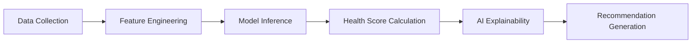

<div align="center">

# 🇦🇫 Afghanistan Telecom Churn Prediction & Retention System

[](https://www.python.org/)
[](https://flask.palletsprojects.com/)
[](https://www.mysql.com/)
[](https://scikit-learn.org/)
[](LICENSE)

**A comprehensive Decision Support System (DSS) for predicting telecom customer churn and generating automated retention strategies across Afghanistan's 34 provinces.**

[Features](#-features) • [Installation](#-installation) • [Usage](#-usage) • [Documentation](#-documentation) • [Contributing](#-contributing)

</div>

---

## 📋 Project Overview

The **Afghanistan Telecom Churn Prediction and Retention System (ATCPRS)** is a production-ready web application designed to help telecom operators identify customers at risk of churning and implement proactive retention strategies. The system leverages machine learning algorithms to analyze customer behavior patterns and provide actionable insights for reducing customer attrition.

### 🎯 Key Highlights

- **🤖 AI-Powered Predictions**: Machine learning models (Logistic Regression, Random Forest, XGBoost) for accurate churn prediction
- **📊 Real-Time Analytics**: Live dashboard with KPIs, charts, and risk monitoring
- **🎨 Modern UI**: Glassmorphism design with dark/light mode support
- **🔔 Early Warning System**: Automated alerts for rapid risk increases
- **💰 Financial Impact Analysis**: Revenue risk quantification and prioritization
- **🎮 What-If Simulator**: Test retention strategies before implementation
- **👥 Customer Portal**: Dedicated interface for customer self-service predictions
- **📱 Responsive Design**: Works seamlessly on all device sizes

### 🛠️ Technology Stack

| Component | Technology |
|-----------|------------|
| **Backend** | Flask (Python Web Framework) |
| **Database** | MySQL 5.7+ with SQLAlchemy ORM |
| **ML/AI** | scikit-learn, XGBoost, pandas |
| **Frontend** | Bootstrap 5, Chart.js, jQuery |
| **Styling** | Custom CSS with Glassmorphism |
| **Authentication** | Session-based with role-based access |

---

## 😤 Problem Statement

Telecom operators in Afghanistan face significant challenges with customer churn, leading to substantial revenue loss and reduced market competitiveness. Key challenges include:

- ❌ **Lack of Predictive Analytics:** Inability to identify customers at risk of churning before they leave
- ❌ **No Proactive Retention:** Reactive approach to customer retention rather than proactive intervention
- ❌ **Limited Customer Insights:** Insufficient understanding of churn drivers across different provinces
- ❌ **No Financial Impact Analysis:** Inability to quantify the revenue impact of customer churn
- ❌ **Manual Processes:** Time-consuming manual analysis of customer data without automated tools

## 🎯 Objectives

The primary objectives of this system are:

1. **🤖 Predictive Modeling** - Develop accurate machine learning models to predict customer churn probability
2. **🔔 Early Warning** - Implement an early warning system to detect rapid increases in customer risk
3. **💚 Customer Health Assessment** - Provide comprehensive health scores for customers based on multiple factors
4. **🧠 AI-Powered Insights** - Generate automated business insights from customer data
5. **💰 Financial Impact Analysis** - Quantify the revenue impact of churn and prioritize retention efforts
6. **🎮 Decision Support** - Enable what-if scenario analysis to test retention strategies
7. **📊 Comprehensive Reporting** - Provide detailed reports for strategic decision-making

## 📏 Scope

### In Scope

- 🗺️ **Coverage:** All 34 provinces of Afghanistan
- 👥 **Customer Base:** 15,000+ customer records with comprehensive demographic and usage data
- 🔢 **Prediction Features:** 15 key customer attributes including demographics, usage patterns, and service quality metrics
- 🤖 **ML Models:** Multiple algorithms (Logistic Regression, Random Forest, XGBoost) with automated model selection
- 📈 **Real-time Analytics:** Dashboard with live KPIs, charts, and risk monitoring
- 💡 **Retention Recommendations:** Rule-based recommendations for customer retention strategies
- 📄 **Reporting:** PDF, Excel, and CSV export capabilities

### Out of Scope

- ❌ Real-time call data processing
- ❌ Network infrastructure management
- ❌ Billing system integration
- ❌ Customer communication automation
- ❌ Social media sentiment analysis

---

## ✨ Features

### 🔐 Authentication & Authorization

- Secure admin login with session management
- Role-based access control (Admin & Customer)
- Customer portal with dedicated login
- Session timeout and logout functionality

### 👥 Customer Management

- Add, edit, delete customers with comprehensive forms
- Search and multi-filter customer database
- Pagination for large datasets
- Customer profile page with detailed information
- Live churn prediction on customer profiles
- Customer health score badge display
- Customer Workspace with advanced features

### 🔮 Churn Prediction

- Single customer prediction with 15-feature input form
- **Live editable prediction** with real-time updates
- Batch prediction from CSV upload
- Churn probability calculation with confidence scores
- Risk level classification (Low, Medium, High, Critical)
- AI explainability with feature contribution analysis
- Customer health score integration (0-100 scale)

### 💚 Customer Health Score

- Health score calculation based on:
  - Complaint count
  - Inactive days
  - Network quality
  - Recharge frequency
  - Call drop rate
  - Competitor offer exposure
- Health status categories: Critical, Warning, Good, Excellent
- Health badge display across all customer views

### 🧠 AI Manager Insights

- Automated business insights from analytics data:
  - Complaint impact analysis
  - Inactivity risk correlation
  - Network quality impact assessment
  - Recharge frequency correlation
  - Regional risk identification
  - Competitor pressure analysis
- Severity-based insight classification (High/Medium)

### 🔔 Early Warning System

- Risk change tracking over time
- Alert generation for rapid risk increase (>20% threshold)
- Recent warnings display with risk history
- Top risk customers with trend analysis
- Risk history API for scheduled monitoring

### 💰 Financial Impact Analysis

- Revenue risk calculation for high-risk customers
- Monthly and yearly revenue loss estimation
- Province-wise revenue risk breakdown
- Average revenue per customer analysis
- Chart.js visualization of risk distribution

### 🎮 What-If Simulator

- Simulate feature changes and their impact on churn probability
- Risk improvement analysis
- Impact breakdown cards
- Scenario comparison capabilities

### 🤖 ML Center

- Dataset overview and statistics
- Model training with multiple algorithms
- Model comparison and performance metrics
- Confusion matrix visualization
- ROC curve analysis
- Feature importance ranking
- Best model selection and deployment
- Training history tracking
- Model download functionality
- Model diagnostics with overfitting detection

### 📊 Analytics Dashboard

- Real-time KPIs (total, churn, active customers)
- Average recharge and complaint metrics
- Province risk ranking
- Feature importance visualization
- Province and complaint analysis
- Customer segmentation by tenure
- Churn heatmap by province
- Top-risk customers list
- AI insights panel
- Real-time data viewer with live monitoring

### 📄 Reports

- PDF report generation with comprehensive analytics
- Excel export with detailed customer data
- CSV export for data analysis
- Customizable report parameters

### 🎨 User Interface

- Premium dark-blue/purple glassmorphism theme
- Light/Dark mode toggle with theme persistence
- Responsive design for all screen sizes
- Bootstrap 5 components
- Chart.js interactive visualizations
- Smooth animations and transitions
- Transparent sidebar with custom scrollbar

### 👤 Customer Portal

- Dedicated customer login interface
- Live editable prediction page
- Personal risk status dashboard
- Customized recommendations view
- Customer profile management
- Real-time data viewer for customers

---

## � Project Structure

```
afghanistan-telecom-churn-prediction/
├── app/                          # Main application package
│   ├── __init__.py              # Application factory
│   ├── config.py                # Configuration settings
│   ├── constants.py             # Application constants
│   ├── extensions.py            # Flask extensions (db, etc.)
│   ├── models/                  # SQLAlchemy models
│   │   ├── __init__.py
│   │   ├── customer.py
│   │   ├── province.py
│   │   ├── customer_risk_history.py
│   │   ├── prediction_log.py
│   │   ├── recommendation_log.py
│   │   └── training_history.py
│   ├── routes/                  # Flask blueprints (controllers)
│   │   ├── __init__.py
│   │   ├── auth.py
│   │   ├── dashboard.py
│   │   ├── customer.py
│   │   ├── prediction.py
│   │   ├── analytics.py
│   │   ├── ml_center.py
│   │   ├── whatif_simulator.py
│   │   ├── early_warning.py
│   │   ├── financial_impact.py
│   │   ├── reports.py
│   │   ├── customer_portal.py
│   │   └── helpers.py
│   ├── ml/                      # Machine learning module
│   │   ├── __init__.py
│   │   ├── predictor.py
│   │   ├── train.py
│   │   ├── diagnostics.py
│   │   └── recommendations.py
│   └── services/                # Business logic services
│       ├── __init__.py
│       └── logging_service.py
├── scripts/                     # Utility scripts
│   ├── generate_dataset.py
│   └── seed_db.py
├── static/                      # Static assets
│   ├── css/
│   ├── js/
│   └── uploads/
├── templates/                   # Jinja2 templates
│   ├── base.html
│   ├── dashboard.html
│   ├── customer_portal/
│   └── ...
├── sql/                         # Database schema scripts
│   ├── schema.sql
│   ├── seed_provinces.sql
│   └── add_customer_risk_history.sql
├── docs/                        # Documentation
├── tests/                       # Test files
├── dataset/                     # Dataset storage
├── models_ml/                   # Trained ML models
├── .env.example                 # Environment variables template
├── .gitignore                   # Git ignore rules
├── requirements.txt             # Python dependencies
├── run.py                       # Application entry point
├── app.py                       # Application factory (legacy)
└── README.md                    # Project documentation
```

---

## �🗄️ Database Design

### Database Schema

The system uses MySQL with the following main tables:

| Table | Description |
|-------|-------------|
| **provinces** | Afghanistan's 34 provinces with security level classification |
| **customers** | Customer demographic, usage, and churn data (17 attributes) |
| **customer_risk_history** | Tracks customer risk score changes over time |
| **prediction_log** | Logs prediction requests and results |
| **recommendation_log** | Logs recommendation generation events |

### Database Relationships

- **One-to-Many:** provinces → customers
- **One-to-Many:** customers → customer_risk_history
- **Cascade Delete:** Maintains referential integrity

### Normalization

The database is fully normalized to **Third Normal Form (3NF)**, ensuring:

- ✅ No data redundancy
- ✅ No update anomalies
- ✅ No insertion/deletion anomalies
- ✅ Clear separation of concerns

---

## 🤖 Machine Learning Models

### Model Selection

| Algorithm | Description | Best For |
|-----------|-------------|----------|
| **Logistic Regression** | Baseline model with interpretable coefficients | Understanding feature importance |
| **Random Forest** | Ensemble method with decision trees | Non-linear relationships |
| **XGBoost** | Gradient boosting algorithm | High accuracy on imbalanced datasets |

### Model Training

- **📊 Dataset:** 15,000 customer records with 15 features
- **🎯 Target Variable:** Churn (binary: 0 = No, 1 = Yes)
- **✂️ Train/Test Split:** 80/20 stratified split
- **🔄 Cross-Validation:** 5-fold cross-validation
- **📈 Performance Metrics:** Accuracy, Precision, Recall, F1-Score, ROC-AUC

### Model Evaluation

- **Confusion Matrix:** True/False Positive/Negative analysis
- **ROC Curve:** Trade-off between sensitivity and specificity
- **Feature Importance:** Ranking of churn drivers
- **Best Model Selection:** Automatic selection based on ROC-AUC score

---

## 🔮 Churn Prediction Process

### Prediction Workflow



### Prediction Output

| Output | Description |
|--------|-------------|
| **Churn Probability** | 0-100% likelihood of churn |
| **Risk Level** | Low, Medium, High, Critical |
| **Health Score** | 0-100 customer health score |
| **Health Status** | Critical, Warning, Good, Excellent |
| **Feature Contributions** | Impact of each feature on prediction |
| **Recommendations** | 3-4 actionable retention strategies |

---

## 💡 Retention Recommendation System

### Recommendation Categories

| Category | Examples |
|----------|----------|
| **Support Interventions** | Priority support, dedicated account manager |
| **Engagement Strategies** | Loyalty programs, value-added services |
| **Discount Offers** | Recharge discounts, bundle packages |
| **Loyalty Programs** | Tier-based rewards, VIP status |

---

## 📊 Dashboard Features

### Key Performance Indicators (KPIs)

- 📈 Total Customers
- 📉 Churned Customers
- ✅ Active Customers
- 💰 Average Recharge
- 📞 Average Complaints
- ⚠️ High Risk Customers

### Visualizations

- 🥧 Pie Charts (Churn distribution, province distribution)
- 📊 Bar Charts (Feature importance, complaint analysis)
- 📈 Line Charts (Trends over time, risk progression)
- 🗺️ Heatmaps (Province-wise churn rates)
- 🍩 Doughnut Charts (Revenue risk distribution)

---

## 🚀 Installation Guide

### Prerequisites

- [Python](https://www.python.org/) 3.10 or higher
- [MySQL](https://www.mysql.com/) 5.7 or higher
- [pip](https://pip.pypa.io/) package manager
- [Git](https://git-scm.com/) (for cloning repository)

### Quick Start

```bash
# 1. Clone the repository
git clone https://github.com/yourusername/afghanistan-telecom-churn-prediction.git
cd afghanistan-telecom-churn-prediction

# 2. Create virtual environment
python -m venv venv
venv\Scripts\activate  # Windows
# source venv/bin/activate  # macOS/Linux

# 3. Install dependencies
pip install -r requirements.txt

# 4. Configure database
mysql -u root -p
CREATE DATABASE telecom_churn_db CHARACTER SET utf8mb4 COLLATE utf8mb4_unicode_ci;
exit

# 5. Run schema scripts
mysql -u root -p telecom_churn_db < sql/schema.sql
mysql -u root -p telecom_churn_db < sql/seed_provinces.sql

# 6. Configure environment
copy .env.example .env  # Windows
# cp .env.example .env  # macOS/Linux

# Edit .env with your credentials

# 7. Generate dataset
python scripts/generate_dataset.py

# 8. Seed database
python scripts/seed_db.py

# 9. Train ML model
python -m app.ml.train

# 10. Run application
python run.py
```

The application will start on `http://localhost:5000`

### Environment Variables

```env
DB_HOST=localhost
DB_USER=root
DB_PASSWORD=your_password
DB_NAME=telecom_churn_db
SECRET_KEY=your_secret_key_here
ADMIN_USERNAME=admin
ADMIN_PASSWORD=admin123
CUSTOMER_USERNAME=customer
CUSTOMER_PASSWORD=customer123
```

---

## 📖 Usage Guide

### Login Credentials

| Role | Username | Password |
|------|----------|----------|
| **Admin** | `admin` | `admin123` |
| **Customer** | `customer` | `customer123` |

### Dashboard Navigation

| Module | Description |
|--------|-------------|
| **Dashboard** | Overview with KPIs and charts |
| **Customers** | Customer management and search |
| **Prediction** | Churn prediction interface |
| **What-If Simulator** | Scenario analysis tool |
| **Analytics** | Detailed analytics and insights |
| **ML Center** | Model training and management |
| **Early Warning** | Risk monitoring and alerts |
| **Financial Impact** | Revenue risk analysis |
| **Reports** | Export functionality |

### Customer Portal Features

- 🔮 **Live Prediction** - Edit data and see real-time predictions
- 💚 **Risk Status** - Personal health score and risk assessment
- 💡 **Recommendations** - Customized retention strategies
- 👤 **Profile** - Personal account information
- 📊 **Live Data** - Real-time system statistics

---

## 📸 Screenshots

*Note: Screenshots will be added during final documentation phase.*

### Dashboard View

- KPI cards with key metrics
- Province risk ranking chart
- Top risk customers table

### Prediction Interface

- 15-feature input form
- Live prediction results with AI explainability
- Health score badge

### Customer Portal

- Live editable prediction page
- Personal risk status dashboard
- Real-time data viewer

---

## 🔮 Future Enhancements

### Short-term (3-6 months)

- 📱 **Mobile Application** - Native iOS and Android apps
- 🔗 **Real-time Integration** - API integration with billing systems
- 📊 **Advanced Analytics** - Customer lifetime value prediction

### Long-term (6-12 months)

- 🗣️ **NLP** - Sentiment analysis and chatbot support
- 🗺️ **Geospatial Analysis** - Map-based churn hotspots
- 🧠 **Deep Learning** - Advanced prediction models
- 🔌 **Integrations** - CRM and marketing automation

---

## 📚 Documentation

- [Database Schema](docs/DATABASE_SCHEMA.md)
- [Data Dictionary](docs/DATA_DICTIONARY.md)
- [ERD Diagram](docs/ERD.md)
- [API Documentation](docs/API.md)
- [System Testing](docs/SYSTEM_TESTING.md)
- [Customer Module](docs/CUSTOMER_MODULE.md)
- [Model Diagnostics](docs/MODEL_DIAGNOSTICS.md)
- [Real-Time Data Viewer](docs/REALTIME_DATA_VIEWER.md)

---

## ⚠️ Security Note

**Important:** Change default credentials in production via environment variables:

- `ADMIN_USERNAME` and `ADMIN_PASSWORD` for admin access
- `CUSTOMER_USERNAME` and `CUSTOMER_PASSWORD` for customer portal

---

## 📄 License

This project is developed for academic purposes as part of a thesis on telecom churn prediction and retention systems.

---

## 🤝 Contributing

Contributions are welcome! Please feel free to submit a Pull Request.

---

## 📧 Contact

For questions or support, please contact the development team.

---

## 🙏 Acknowledgments

- [Flask](https://flask.palletsprojects.com/) - Web framework
- [scikit-learn](https://scikit-learn.org/) & [XGBoost](https://xgboost.readthedocs.io/) - ML libraries
- [Bootstrap 5](https://getbootstrap.com/) - UI framework
- [Chart.js](https://www.chartjs.org/) - Visualization library
- [MySQL](https://www.mysql.com/) - Database

---

<div align="center">

**⭐ Star this repository if you find it helpful!**

Made with ❤️ for Afghanistan Telecom

</div>
