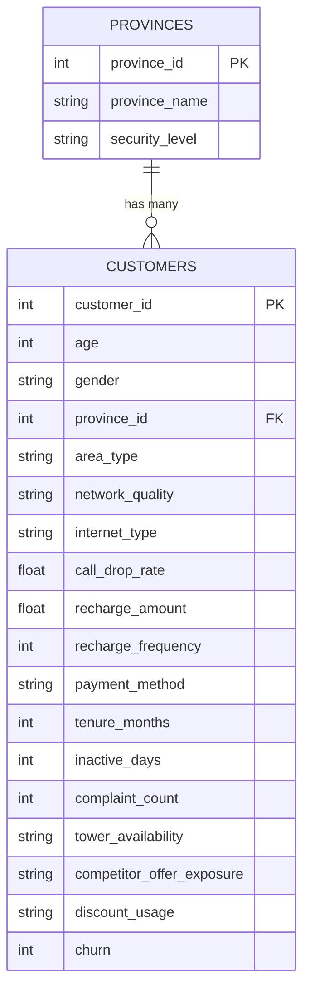

# Entity Relationship Diagram

```
┌────────────────────────────┐
│         PROVINCES          │
├────────────────────────────┤
│ PK  province_id     INT    │
│     province_name   VARCHAR│
│     security_level  VARCHAR│
└────────────┬───────────────┘
             │ 1
             │
             │ has many
             │
             │ N
┌────────────┴───────────────────────────────┐
│                 CUSTOMERS                   │
├─────────────────────────────────────────────┤
│ PK  customer_id                INT          │
│     age                        INT          │
│     gender                     VARCHAR      │
│ FK  province_id  ──────────────► provinces  │
│     area_type                  VARCHAR      │
│     network_quality            VARCHAR      │
│     internet_type              VARCHAR      │
│     call_drop_rate             FLOAT        │
│     recharge_amount            FLOAT        │
│     recharge_frequency         INT          │
│     payment_method             VARCHAR      │
│     tenure_months              INT          │
│     inactive_days              INT          │
│     complaint_count            INT          │
│     tower_availability         VARCHAR      │
│     competitor_offer_exposure  VARCHAR      │
│     discount_usage             VARCHAR      │
│     churn                      TINYINT      │
└─────────────────────────────────────────────┘
```

**Cardinality:** `Province (1) ──< Customer (N)`

A province can have many customers; every customer belongs to exactly one
province. Deleting a province cascades to its customers.

## Mermaid version

