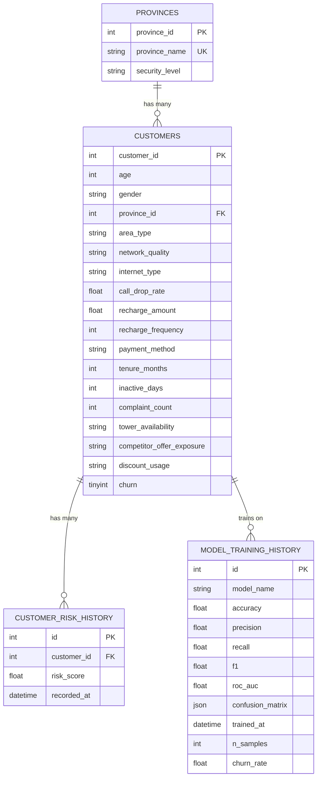
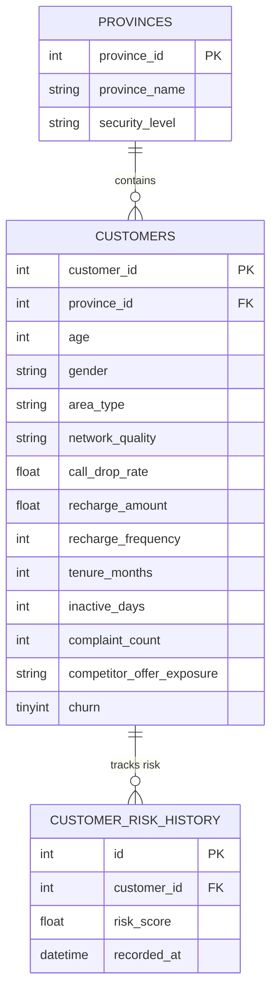

# ERD Diagram - Mermaid Syntax

## Database Entity Relationship Diagram

## Simplified ERD (Core Tables)

## Entity Relationship Details

### Relationships
- **PROVINCES → CUSTOMERS**: One-to-Many (One province has many customers)
- **CUSTOMERS → CUSTOMER_RISK_HISTORY**: One-to-Many (One customer has many risk history records)
- **CUSTOMERS → MODEL_TRAINING_HISTORY**: One-to-Many (Customers are used to train models)

### Foreign Keys
- `customers.province_id` → `provinces.province_id` (CASCADE DELETE)
- `customer_risk_history.customer_id` → `customers.customer_id` (CASCADE DELETE)

### Indexes
- `idx_customers_province` on `customers.province_id`
- `idx_customers_churn` on `customers.churn`
- `idx_risk_customer` on `customer_risk_history.customer_id`
- `idx_risk_recorded` on `customer_risk_history.recorded_at`
