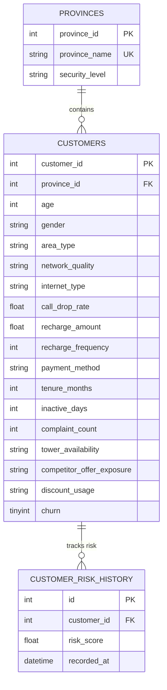
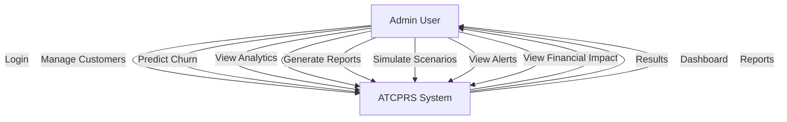
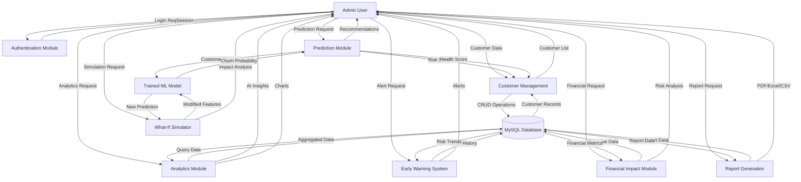
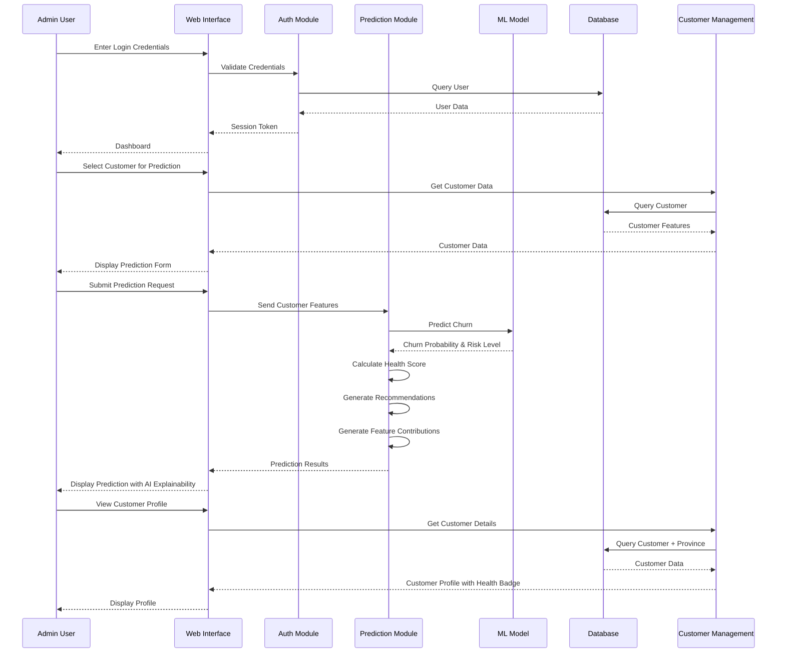
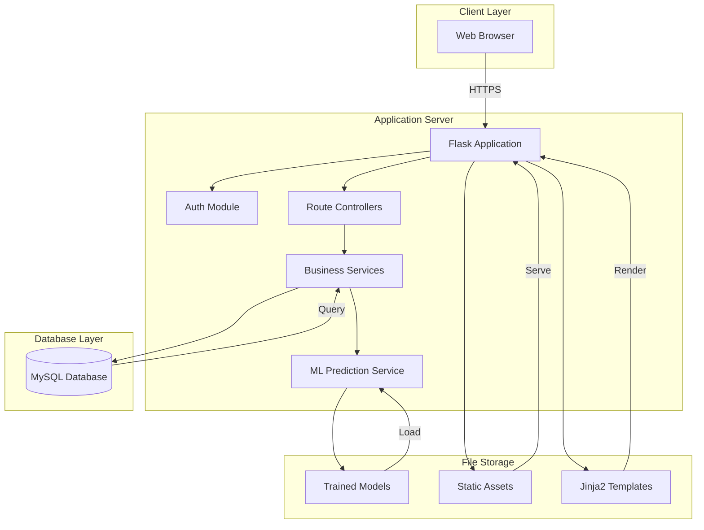
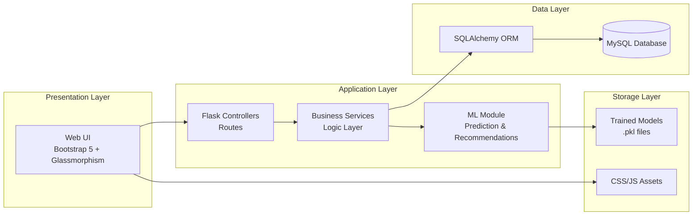
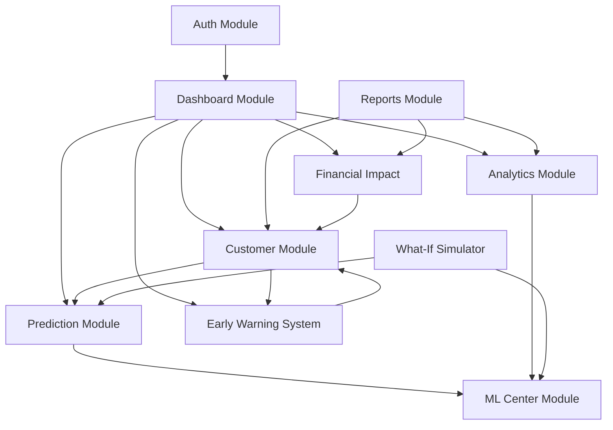

# Thesis Diagrams

**Project:** Afghanistan Telecom Churn Prediction and Retention System (ATCPRS)
**Date:** June 22, 2026
**Purpose:** System architecture and design diagrams for thesis documentation

---

## 1. Entity Relationship Diagram (ERD)

---

## 2. DFD Level 0 (Context Diagram)

---

## 3. DFD Level 1

---

## 4. Use Case Diagram

```mermaid
flowchart TD
    Admin[Admin User] --> UC1[Login]
    Admin --> UC2[Manage Customers]
    Admin --> UC3[Predict Churn]
    Admin --> UC4[View Dashboard]
    Admin --> UC5[View Analytics]
    Admin --> UC6[Use What-If Simulator]
    Admin --> UC7[View Early Warnings]
    Admin --> UC8[View Financial Impact]
    Admin --> UC9[Generate Reports]
    Admin --> UC10[Manage ML Models]
    
    UC2 --> UC2a[Add Customer]
    UC2 --> UC2b[Edit Customer]
    UC2 --> UC2c[Delete Customer]
    UC2 --> UC2d[View Customer Profile]
    
    UC3 --> UC3a[Single Prediction]
    UC3 --> UC3b[Batch Prediction]
    UC3 --> UC3c[View AI Explainability]
    
    UC4 --> UC4a[View KPIs]
    UC4 --> UC4b[View Charts]
    UC4 --> UC4c[View Top Risk Customers]
    
    UC5 --> UC5a[View Feature Importance]
    UC5 --> UC5b[View Churn Heatmap]
    UC5 --> UC5c[View AI Insights]
    
    UC9 --> UC9a[Export PDF]
    UC9 --> UC9b[Export Excel]
    UC9 --> UC9c[Export CSV]
```

---

## 5. Sequence Diagram - Customer Churn Prediction

---

## 6. Deployment Architecture Diagram

---

## 7. System Architecture Overview

---

## 8. Module Interaction Diagram

---

## Diagram Legend

### Symbols Used
- **||--o{**: One-to-Many relationship
- **-->**: Data flow / dependency
- **[( )**: Database entity
- **[ ]**: Process / module
- **{ }**: Data store

### Color Coding (if supported)
- **Blue**: User / External entities
- **Green**: Application modules
- **Orange**: Database / Storage
- **Purple**: ML / AI components

---

## Notes

1. **Production Focus**: All diagrams represent the deployed production system
2. **No Training Pipeline**: Data cleaning, feature engineering, and model training are excluded
3. **No Notebooks**: Jupyter notebooks and development tools are not shown
4. **Real-time Operations**: Diagrams show runtime operations, not development workflows
5. **Simplified View**: Complex internal logic is abstracted for clarity

---

## Usage in Thesis

These diagrams can be directly included in thesis documentation using:
- Mermaid-compatible markdown editors
- GitHub (native Mermaid support)
- VS Code with Mermaid extension
- Export to PNG/SVG for LaTeX inclusion
